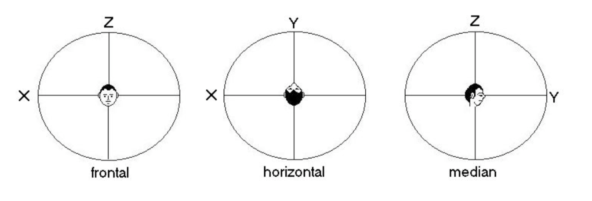

# Spatial Perception of Sound

Before we talk about how to spatialize sound in software, let's start with how we perceive sound in space.

The way we perceive the position of sound in space is mostly related to our physiology: your pinna, the size of your head, the density of your body, your height, etc. You have learned over your lifetime exactly how sound passes through you and now you can accurately understand sound in space. 

## [SPATIAL LISTENING AND ITS COMPUTER SIMULATION ON ELECTRONIC MUSIC](../assets/spatial-listening.pdf)

All text quoted from the Oscar Pablo Di Liscia

When we are interested on the spatial quality of sound, our Auditory System inspects an incoming acoustic signal trying to answer two main questions:

1) Where am I? (information related to the room or environment)
2) Where is it? (information related to the location and / or movement of a sound source)

To do this, our Auditory System uses _cues_. this information is combined with other kind of information coming from our other senses (mainly our view), and with our knowledge of the behavior of the sound source. That is, our perception of space is holistic .

### Horizontal Plane

ITD (Interaural Time Difference): The difference in arrival time of the signal at our different ears due to the location of the sound source at an horizontal angle other than 90 degrees and 270 degrees. Seems to be effective at frequencies below 900 Hz.

ILD (Interaural Level Difference): The difference in level of the signal at our different ears. Seems to be effective at frequencies above 500 Hz. Lower frequencies have a wavelength larger than our head, thus diffracting it.

We meet our best angle of discrimination on the horizontal plane, of course, when we face the sound source. We loose accuracy as this angle goes to both sides of our head

### Median Plane

When the source is located on this plane, the cues rendered by the ITD and ILD are the same for both ears, so it seems that the complex effect of filtering due to the convolution of the signal with the shape of our upper torso, neck, head, and external ears is most responsible for rendering data for location. 

### Distance

Global loudness of the sound: despite of its apparent simplicity the loudness of sound is a weak cue to judge the distance between source and listener. Physically speaking, it is well known that the acoustic energy drops proportionally to the square of distance.

Ratio between reverberated and dry signal. In closed rooms, the energy of dense reverberation will remain more or less constant (in average amplitude, and for a source delivering the same energy) while –if the distance changes- the energy of the direct (dry) signal will drop with distance. 

Absorption of high frequencies due to gasses in the air. This effect is similar to a lowpass filter, and is considered relevant only for distances larger than 50 meters.
